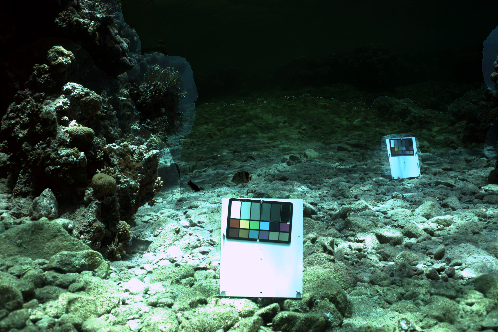
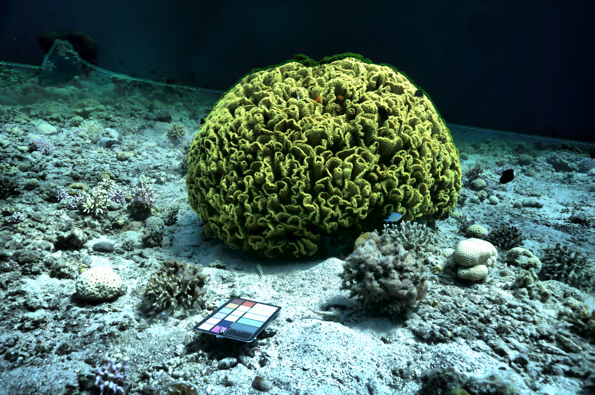

# 🌊 Underwater Image Turbidity Removal

> 🚀 Internship Project @ DIAT (Defence Institute of Advanced Technology) | I4 Marine Technologies  
> Role: Software Developer Intern  

---

## 📸 Results (Before vs After)

### Sample 1

<table>
  <tr>
    <th>Before</th>
    <th>After</th>
  </tr>
  <tr>
    <td></td>
    <td></td>
  </tr>
</table>

### Sample 2
<table>
  <tr>
    <th>Before</th>
    <th>After</th>
  </tr>
  <tr>
    <td></td>
    <td></td>
  </tr>
</table>

---

## 📌 Overview

Underwater images suffer from turbidity due to suspended particles, causing:
- Low contrast  
- Color distortion  
- Blurred visibility  

### 💡 Solution
Developed a **depth-aware image enhancement pipeline** to restore clarity and color fidelity for marine and defense applications.

---

## 📊 Impact

- ✅ **+40% improvement** in SSIM  
- ✅ **+7 dB increase** in PSNR  
- ✅ **50% faster processing** (40 min → 20 min)  
- ✅ Tested on **200+ real-world images**

---

## ⚙️ Tech Stack

- Python  
- OpenCV, NumPy, scikit-image, Pillow  
- NumPy  
- PyTorch (Monodepth2)  
- Jupyter Notebook / VS Code  

---

## ⚠️ Challenges & Solutions

### 1. Inconsistent Color Correction
✔ Solved using depth-aware normalization and color correction algorithms

### 2. High Processing Time
✔ Reduced by automation + pipeline optimization (50% faster)

### 3. Missing Depth Data
✔ Integrated monocular depth estimation (Monodepth2)

---

## 📎 Detailed Case Study
👉 [View Full Documentation (Notion)](https://www.notion.so/Underwater-Image-Turbidity-Removal-32ee8d5b215481c3bad9d4da351607d0)

---

## 🔒 Note
This project was conducted under NDA.  
Source code is proprietary. Only methodology and results are shared.
